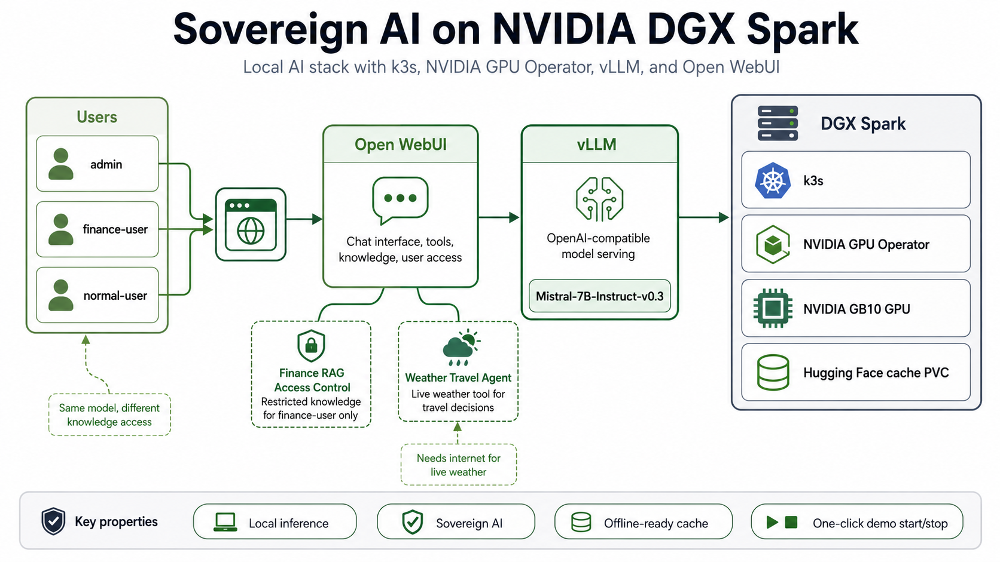

# Sovereign AI on NVIDIA DGX Spark

Deploy a local, sovereign AI stack on **NVIDIA DGX Spark** using **k3s**, **NVIDIA GPU Operator**, **vLLM**, and **Open WebUI**.


> Local LLM inference, permission-aware RAG, and simple tool-calling demos on DGX Spark.

---



The stack runs locally on DGX Spark and exposes a browser-based Open WebUI interface through a local port-forward.

```text
Users
  → Open WebUI
  → vLLM OpenAI-compatible API
  → Mistral-7B-Instruct-v0.3
  → NVIDIA GB10 GPU on DGX Spark
```

---

## What this repository contains

This repository provides:

- Kubernetes manifests for running vLLM and Open WebUI on DGX Spark
- persistent Hugging Face model cache configuration
- offline-ready startup behavior after the model is cached
- one-command demo start and stop scripts
- documentation for installation, operation, offline use, architecture, and troubleshooting
- reusable demo examples:
  - finance RAG access control
  - weather travel agent

---

## Stack

| Layer | Component |
|---|---|
| Hardware | NVIDIA DGX Spark |
| GPU | NVIDIA GB10 |
| OS | Ubuntu 24.04 |
| Kubernetes | k3s |
| GPU integration | NVIDIA GPU Operator |
| Model serving | vLLM |
| Chat UI | Open WebUI |
| Default model | `mistralai/Mistral-7B-Instruct-v0.3` |
| Model cache | Hugging Face cache PVC |
| Access URL | `http://dgx-demo.test:18080` |

---

## Repository structure

```text
sovereign-ai-dgx-spark/
├── README.md
├── LICENSE
├── manifests/
│   ├── 00-gpu-smoke.yaml
│   ├── 01-hf-cache-pvc.yaml
│   ├── 02-mistral-vllm.yaml
│   └── 10-openwebui.yaml
├── scripts/
│   ├── start-demo.sh
│   ├── stop-demo.sh
│   └── cleanup.sh
├── docs/
│   ├── ARCHITECTURE.md
│   ├── INSTALL.md
│   ├── OFFLINE.md
│   ├── OPERATIONS.md
│   └── TROUBLESHOOTING.md
└── examples/
    ├── finance-rag-access-control/
    └── weather-travel-agent/
```

---

## Quick start

Clone the repository:

```bash
git clone https://github.com/zalborzi/sovereign-ai-dgx-spark.git
cd sovereign-ai-dgx-spark
```

Install and configure the platform by following:

```text
docs/INSTALL.md
```

At a high level, installation requires:

1. working NVIDIA driver and container toolkit
2. k3s
3. Helm
4. NVIDIA GPU Operator
5. Hugging Face token secret
6. Kubernetes manifests
7. Open WebUI configuration

---

## Run the demo

Start:

```bash
./scripts/start-demo.sh
```

Open WebUI:

```text
http://dgx-demo.test:18080
```

Stop:

```bash
./scripts/stop-demo.sh
```

Do **not** use `cleanup.sh` for normal shutdown.

---

## Full cleanup

Use only for full machine reset or handover:

```bash
sudo ./scripts/cleanup.sh
```

Non-interactive:

```bash
sudo FORCE=1 ./scripts/cleanup.sh
```

This removes k3s and local Kubernetes state. It does not remove the NVIDIA driver.

---

## Open WebUI connection

After the first Open WebUI login, configure the OpenAI-compatible endpoint:

```text
Admin Panel → Settings → Connections → OpenAI API
```

Use:

```text
URL: http://mistral.llm.svc.cluster.local:8000/v1
API Key: sk-dummy
```

Then select:

```text
mistralai/Mistral-7B-Instruct-v0.3
```

---

## Offline-ready model cache

The vLLM deployment uses a persistent Hugging Face cache PVC:

```text
hf-cache
```

Mounted at:

```text
/root/.cache/huggingface
```

After the model is downloaded once, the demo can be started without downloading the model again.

Important:

```text
Do not delete the hf-cache PVC unless you want to re-download the model.
```

See:

```text
docs/OFFLINE.md
```

---

## Demo examples

### Finance RAG Access Control

Path:

```text
examples/finance-rag-access-control/
```

Purpose:

```text
Same local model.
Different users.
Different knowledge access.
```

Demo users:

```text
admin
finance-user
normal-user
```

Key message:

```text
The model is shared; the data is not.
```

The finance example uses a synthetic restricted finance document. The `finance-user` can access the restricted knowledge base. The `normal-user` cannot.

---

### Weather Travel Agent

Path:

```text
examples/weather-travel-agent/
```

Purpose:

```text
Local LLM + controlled external tool + live weather recommendation.
```

Example prompt:

```text
Should I do an outdoor customer demo in Luxembourg tomorrow?
```

This demo calls Open-Meteo through an Open WebUI Python tool. It needs internet for live weather.

---

## Documentation

| Document | Purpose |
|---|---|
| [`docs/ARCHITECTURE.md`](docs/ARCHITECTURE.md) | Architecture and component overview |
| [`docs/INSTALL.md`](docs/INSTALL.md) | Clean installation guide |
| [`docs/OFFLINE.md`](docs/OFFLINE.md) | Offline cache behavior and verification |
| [`docs/OPERATIONS.md`](docs/OPERATIONS.md) | Day-to-day start, stop, and demo operation |
| [`docs/TROUBLESHOOTING.md`](docs/TROUBLESHOOTING.md) | Common problems and fixes |

---

## Useful commands

Check nodes:

```bash
kubectl get nodes
```

Check GPU allocation:

```bash
kubectl get nodes -o json | jq '.items[].status.allocatable'
```

Check vLLM logs:

```bash
kubectl -n llm logs deployment/mistral --tail=120
```

Follow vLLM logs:

```bash
kubectl -n llm logs deployment/mistral -f
```

Check Open WebUI logs:

```bash
kubectl -n ui logs deployment/openwebui --tail=120
```

Check Open WebUI internal access to vLLM:

```bash
kubectl -n ui exec deployment/openwebui --   curl -s http://mistral.llm.svc.cluster.local:8000/v1/models
```

Check local browser endpoint:

```bash
curl --noproxy '*' -I http://dgx-demo.test:18080
```

---

## Notes and limitations

This repository is intended for a local DGX Spark demo and learning environment.

It is not a production-hardened deployment.

Not included by default:

- production ingress
- TLS
- enterprise SSO
- Kubernetes NetworkPolicies
- external secret management
- monitoring and alerting
- backup and restore
- audit-grade governance
- hardened multi-tenant isolation

For production use, review the architecture, security boundaries, identity model, network model, and data governance requirements.

---

## Security notes

- Do not commit real Hugging Face tokens.
- Replace demo secrets before real use.
- Open WebUI tools execute Python code on the Open WebUI server.
- Only trusted admins should create or edit Open WebUI tools.
- The finance demo data is synthetic and must stay synthetic.

---

## References

- [k3s Documentation](https://docs.k3s.io/)
- [NVIDIA GPU Operator](https://docs.nvidia.com/datacenter/cloud-native/gpu-operator/latest/getting-started.html)
- [vLLM Documentation](https://docs.vllm.ai/)
- [Open WebUI](https://github.com/open-webui/open-webui)
- [Open-Meteo](https://open-meteo.com/)
- [Hugging Face](https://huggingface.co/)

---

## License

Apache License 2.0 — see [`LICENSE`](LICENSE).

---

## Author

Zia Alborzi - NTT Luxembourg
